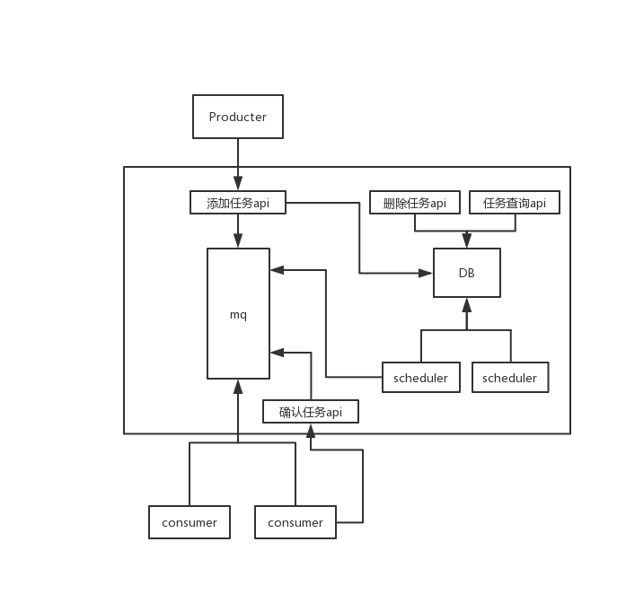

## Architecture



## server api

### add task
```
paths:
  /v1/api/task:
    post:
      summary: 新增任务
      description: 新增一个定时任务
      content: application/json
      parameters: 
        - name: name
          in: body
          description: 任务的名称，这个任务通常对应的是topic下面的tag
          required: true
          type: string
        - name: type
          in: body
          desciption: 任务类型, 1 - 单次任务, 2 - 定时任务， 3 - crontab 任务
          required: true
          type: int
         - name: data
           in: body
           description: 消息序列化之后的内容, 可以是json也可以选择其他序列化方式
           required: true
           type: string
        - name: crontab
          in: body
          description: 定时任务crontab 设置，完全兼容crontab语法, 仅在type 为 3 时需要提供
          required: false
          type: string
        - name: loop_time
          in: body
          description: 任务循环时间，单位为秒, 主要用来处理一些任务是要求间隔一段时间执行一次, 仅 type 为 2 需要提供
          required: false
          type: int
        - name: loop_count:
          in: body
          desciption: 循化次数, 可以用来现在任务的执行次数
          required: false
          type: int
        - name: start_time
          in: body
          description: 任务开始时间戳，设置这个参数之后，任务将在该时间之后才会运行
          required: false
          type: int
        - name: end_time
          in: body
          desciption: 任务结束时间戳, 设置这个参数之后, 任务在这个时间点之后不会再继续执行
          required: false
          type: int
        - name: max_runtime
          in: body
          desciption: 预估任务执行时间，这个是用来和ack配置使用的，目前还未实现
          required: false
          type: int
        - name: ack
          in: body
          description: 是否需要ack, 当前版本可以忽略
          required: false
          type: bool
          
      responses:
        200:
          description: OK
          content:
            application/json:
              schema:
                type: object
                properties:
                  taskid:
                    type: string
                    description: 任务id
                  name:
                    type: string
                    description: 提交的name 
        400:
          description: INVAILD PARAM
          content: application/json
            - err: 错误码
            - msg: 错误消息
        500:
          desciption: INTERNAL SERVER ERROR
          content: application/json
            - err: 错误码
            - msg: 错误提示
            
```

### del task by ids
```
paths:
  /v1/api/delete-task:
    post:
      summary: 根据id删除一个或多个任务
      description: 
      content: application/json
      parameters:
        -name: ids
         in: body
         desciption: 任务名，即为新增任务是新增的name
         required: true
         type: array of string
      responses:
        200:
          description: OK
          content:
            application/json:
              schema:
                type: object
                properties:
                  SucIds:
                    type: array of string
                    description: 被删除的任务id列表
       400:
          description: INVAILD PARAM
          content: application/json
             - err: 错误码
             - msg: 错误消息
       500:
           desciption: INTERNAL SERVER ERROR
           content: application/json
             - err: 错误码
             - msg: 错误提示
```

### del task by name
```
paths:
  /v1/api/delete-task-by-name:
    post:
      summary: 根据任务名称删除一个或多个任务
      description: 
      content: application/json
      parameters:
        -name: name
         in: body
         desciption: 任务名，即为新增任务是新增的name
         required: true
         type: string
      responses:
        200:
          description: OK
          content:
            application/json:
              schema:
                type: object
                properties:
                  SucIds:
                    type: Array of string
                    description: 被删除的任务id列表
       400:
          description: INVAILD PARAM
          content: application/json
             - err: 错误码
             - msg: 错误消息
       500:
           desciption: INTERNAL SERVER ERROR
           content: application/json
             - err: 错误码
             - msg: 错误提示
```

### query task by id
```
paths:
  /v1/api/query-task-by-id:
    get:
      summary: 根据任务id查询任务
      description:
      parameters:
        -name: taskid
         in: query
         desciption: 任务ID
         required: true
         type: string

      responses:
         200:
            description: OK
            content:
              application/json:
                schema:
                  type: object
                  properties:
                    _id:
                      type: string
                      description: 任务id
                    name:
                      type: string
                      desciption: 任务名
                    type:
                      type: int
                      description: 任务类型
                    data:
                      type: string
                      description: 任务内容
                     crontab:
                      type: string
                      description: crontab设置
                     loop_time:
                      type: int
                      description: 循环时间
                     loop_count:
                      type: int
                      description: 循环次数
                    start_time:
                      type: int
                      description: 任务开始时间
                    end_time:
                      type: int
                      description: 任务结束时间
                    created_at:
                       type: int
                        desctiption: 任务创建时间
                     
         400:
            description: INVAILD PARAM
            content: application/json
               - err: 错误码
               - msg: 错误消息
         500:
             desciption: INTERNAL SERVER ERROR
             content: application/json
               - err: 错误码
               - msg: 错误提示
```

### query task by name
```
paths:
  /v1/api/query-task-by-name:
    get:
      summary: 根据任务名称查询任务
      description: 根据任务名称查询任务,按创建时间倒排序
      parameters: 
        - name: name
          in: path
          description: 任务的名称
          required: true
          type: string

      responses:
         200:
            description: OK
            content:
              application/json:
                schema:
                  type: object
                  properties:
                    _id:
                      type: string
                      description: 任务id
                    name:
                      type: string
                      desciption: 任务名
                    type:
                      type: int
                      description: 任务类型
                    data:
                      type: string
                      description: 任务内容
                     crontab:
                      type: string
                      description: crontab设置
                     loop_time:
                      type: int
                      description: 循环时间
                     loop_count:
                      type: int
                      description: 循环次数
                    start_time:
                      type: int
                      description: 任务开始时间
                    end_time:
                      type: int
                      description: 任务结束时间
                    created_at:
                       type: int
                        desctiption: 任务创建时间
                     
         400:
            description: INVAILD PARAM
            content: application/json
               - err: 错误码
               - msg: 错误消息
         500:
             desciption: INTERNAL SERVER ERROR
             content: application/json
               - err: 错误码
               - msg: 错误提示
```

## Usage

* server
```go
package main

import "github.com/xiaojiaoyu100/taskcenter/server"

func main() {
	customFormatter := new(logrus.TextFormatter)
	customFormatter.FullTimestamp = true                        // 显示完整时间
	customFormatter.TimestampFormat = "2006-01-02 15:04:05.000" // 时间格式

	logrus.SetFormatter(customFormatter)
	logrus.SetOutput(os.Stdout)
	logrus.SetLevel(logrus.DebugLevel)

	conf := map[string]string{
		"app.name_alert_count":   viper.GetString("task_center.name_alert_count"),
		"app.total_alert_count":  viper.GetString("task_center.total_alert_count"),
		"mongodb.uri":            viper.GetString("mongodb.uri"),
		"mongodb.db":             viper.GetString("mongodb.db"),
		"redis.addr":             viper.GetString("redis.db"),
		"redis.password":         viper.GetString("redis.password"),
		"redis.db":               viper.GetString("redis.db"),
		"rocketmq.group_id":      viper.GetString("rocketmq.group_id"),
		"rocketmq.instance_name": viper.GetString("rocketmq.instance_name"),
		"rocketmq.namesvr":       viper.GetString("rocketmq.namesvr"),
		"rocketmq.access_key":    viper.GetString("rocketmq.access_key"),
		"rocketmq.secret_key":    viper.GetString("rocketmq.secret_key"),
		"rocketmq.topic":         viper.GetString("rocketmq.topic"),
	}
	svr := server.InitServer(conf)
	svr.Run(viper.GetInt("task_center.port"))

}
```

* client1: 使用全局的client

```go
package main

import (
	"fmt"
	"github.com/xiaojiaoyu100/taskcenter/client"
	"time"
)

func main() {
	ch := make(chan interface{})
	config := map[string]string{
		"groupid":       "groupid",
		"instance_name": "instance_name",
		"namesvr":       "namesvr",
		"access_key":    "access_key",
		"secret_key":    "secret_key",
		"topic":         "topic",
		"servicename":   "servicename",
	}
	client.Init(config)
	defer client.Release()
	client.AddTaskHandler("test1", handleTask)

	client.Start()
	<-ch
}

func handleTask(taskid string, data string, msgid string) {
	fmt.Printf("handleTask taskid=%s, data=%s, msgid=%s", taskid, data, msgid)
}
```

* client2: 不是用全局的client
```go
func main() {
	conf := &mq.ConsumerConfig{
		Instancename: "",
		NameServers:  nil,
		GroupId:      "",
		GroupName:    "",
		Topic:        "",
		AccessKey:    "",
		SecretKey:    "",
	}

	boot := make(chan bool)
	c, err := client.New(conf)
	if err != nil {
		logrus.Fatalf("create client error = %v", err)
	}
	defer c.Release()

	if err := c.Register("tag1", handleTask); err != nil {
		logrus.Fatalf("add task handler error = %v", err)
	}

	err = c.Start()
	if err != nil {
		logrus.Errorf("start consumer error = %v", err)
	}

	<-boot
}

// 如果正常消费返回nil，错误的话返回error 会促发重试, 默认的重试次数是16次
func handleTask(taskid string, data string, msgid string) error {
	fmt.Printf("%v: handleTask taskid=%s, data=%s, msgid=%s\n", time.Now(), taskid, data, msgid)
	return errors.New("retry error")
}
```

## TODO

1. 消息确认机制


## 使用dep管理依赖的项目使用事项

rocketmq-client-go 我们使用的是native分支，所以要在Gopkg.toml override 一下依赖

```shell script
[[override]]
   branch="native"
   name = "github.com/apache/rocketmq-client-go"
```